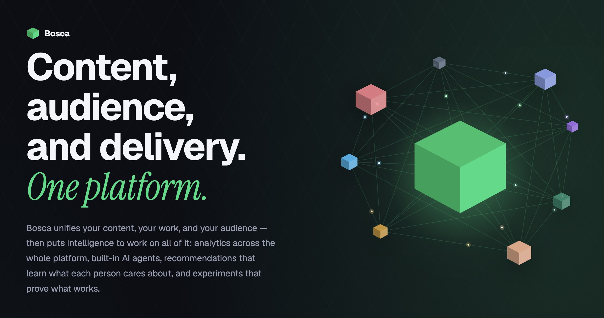

# Bosca

Content, audience, and delivery. One platform.

Bosca unifies your content, your work, and your audience — then puts intelligence to work on all of it: analytics across the whole platform, built-in AI agents, recommendations that learn what each person cares about, and experiments that
prove what works.

Learn more at [bosca.io](https://bosca.io)

NOTE: Packages & CLI tool will be published soon.

## License

Bosca is licensed under the [Apache License 2.0](LICENSE), except for:

- `bosca-yks`, licensed under the [MIT License](bosca-yks/LICENSE).

Bundled third-party material and its licenses are listed in [THIRD_PARTY_NOTICES.md](THIRD_PARTY_NOTICES.md).